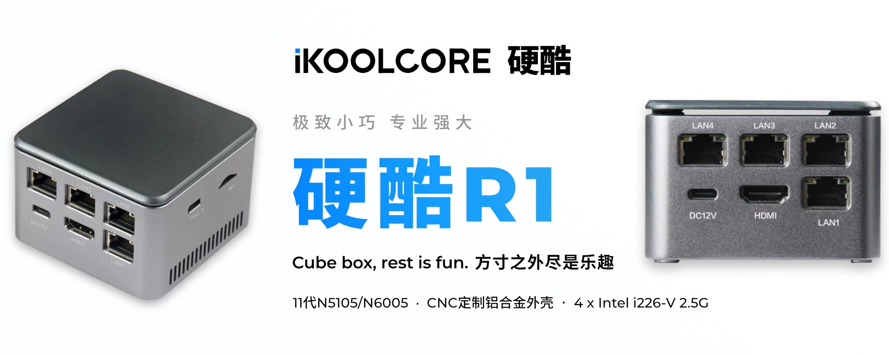

# Welcome to Lean's git source of OpenWrt and packages

I18N: [English](README_EN.md) | [简体中文](README.md) | [日本語](README_JA.md)

## Official Channels

If you have technical questions for discussion or sharing, feel free to join the following channels:

1. QQ Group: *OpenWRT Firmware Technical Research Group*, Group Number is `891659613`.
Join the group: [Link](https://jq.qq.com/?_wv=1027&k=XL8SK5aC "Op固件技术研究群").
    - [Click to download QQ client](https://im.qq.com/pcqq).

2. Telegram Group: *OpenWRT Firmware Technical Research Group*.
Join the group: [Link](https://t.me/JhKgAA6Hx1 "OP 编译官方大群").

## ArmSoM Sige Board Series Introduction

ArmSoM-Sige Series: Your All-in-One Powerhouse for Soft Routing, SBCs, Mini Servers, and Home Automation.

[ArmSoM Store](https://www.aliexpress.com/store/1102800175)

Buy Link ：
[](https://aliexpress.com/item/3256807356692995.html)

## Notice

1. **Never compile OpenWRT as `root`**
2. If you are living in mainland China, please make sure you could visit the **REAL** Internet.
3. Default login IP is `192.168.1.1`, password is `password`.

## How to Compile

1. Install a Linux distribution, Debian or Ubuntu LTS is recommended.

2. Install dependencies:

   ```bash
   sudo apt update -y
   sudo apt full-upgrade -y
   sudo apt install -y ack antlr3 asciidoc autoconf automake autopoint binutils bison build-essential \
   bzip2 ccache cmake cpio curl device-tree-compiler fastjar flex gawk gettext gcc-multilib g++-multilib \
   git gperf haveged help2man intltool libc6-dev-i386 libelf-dev libglib2.0-dev libgmp3-dev libltdl-dev \
   libmpc-dev libmpfr-dev libncurses5-dev libncursesw5-dev libreadline-dev libssl-dev libtool lrzsz \
   mkisofs msmtp nano ninja-build p7zip p7zip-full patch pkgconf python2.7 python3 python3-pyelftools \
   libpython3-dev qemu-utils rsync scons squashfs-tools subversion swig texinfo uglifyjs upx-ucl unzip \
   vim wget xmlto xxd zlib1g-dev python3-setuptools
   ```

3. Clone the source code, update `feeds` and configure:

   ```bash
   git clone https://github.com/coolsnowwolf/lede
   cd lede
   ./scripts/feeds update -a
   ./scripts/feeds install -a
   make menuconfig
   ```

4. Download libraries and compile firmware
   > (`-j` is the thread count, single-thread is recommended for the first build):

   ```bash
   make download -j8
   make V=s -j1
   ```

These commands are supposed to compile the source code successfully.
All source code of R23 is included, including IPK.

You can use this source code freely, but please link this GitHub repository when redistributing.
Thank you for your cooperation!

Rebuild:

```bash
cd lede
git pull
./scripts/feeds update -a
./scripts/feeds install -a
make defconfig
make download -j8
make V=s -j$(nproc)
```

If reconfiguration is need:

```bash
rm -rf ./tmp && rm -rf .config
make menuconfig
make V=s -j$(nproc)
```

Build artifacts will be outputted to `bin/targets` directory.

### If you are using WSL/WSL2 as your build environment

WSL's `PATH` potentially contain Windows paths with spaces, which may cause compilation failure.
Please add the following lines to your local environment profiles before compiling:

```bash
# Update and reload your profile, ~/.bashrc for example.
cat << EOF >> ~/.bashrc
export PATH="/usr/local/sbin:/usr/local/bin:/usr/sbin:/usr/bin:/sbin:/bin:$PATH"
EOF
source ~/.bashrc
```

NTFS-formatted drives mounted to a WSL distribution will be case-insensitive by default.
This will cause the following error when compiling in WSL/WSL2:

```txt
Build dependency: OpenWrt can only be built on a case-sensitive filesystem
```

A simple solution is to create a case-sensitive directory for the repository before `git clone`:

```powershell
# Open a terminal as administrator
PS > fsutil.exe file setCaseSensitiveInfo <your_local_lede_path> enable
# Clone this repository to the case-sensitive directory <your_local_lede_path>
PS > git clone git@github.com:coolsnowwolf/lede.git <your_local_lede_path>
```

> For directories that have already been `git clone`, `fsutil.exe` will not take effect.
> Case sensitivity will only be enabled for new changes in the directory.

### macOS Compilation

1. Install Xcode from AppStore

2. Install Homebrew:

   ```bash
   /usr/bin/ruby -e "$(curl -fsSL https://raw.githubusercontent.com/Homebrew/install/master/install)"
   ```

3. Install toolchain, dependencies and packages with Homebrew:

   ```bash
   brew unlink awk
   brew install coreutils diffutils findutils gawk gnu-getopt gnu-tar grep make ncurses pkg-config wget quilt xz
   brew install gcc@11
   ```

4. Update your system environment:

   - mac with intel chip

   ```bash
   echo 'export PATH="/usr/local/opt/coreutils/libexec/gnubin:$PATH"' >> ~/.bashrc
   echo 'export PATH="/usr/local/opt/findutils/libexec/gnubin:$PATH"' >> ~/.bashrc
   echo 'export PATH="/usr/local/opt/gnu-getopt/bin:$PATH"' >> ~/.bashrc
   echo 'export PATH="/usr/local/opt/gnu-tar/libexec/gnubin:$PATH"' >> ~/.bashrc
   echo 'export PATH="/usr/local/opt/grep/libexec/gnubin:$PATH"' >> ~/.bashrc
   echo 'export PATH="/usr/local/opt/gnu-sed/libexec/gnubin:$PATH"' >> ~/.bashrc
   echo 'export PATH="/usr/local/opt/make/libexec/gnubin:$PATH"' >> ~/.bashrc
   ```

   - mac with apple chip

   ```zsh
   echo 'export PATH="/opt/homebrew/opt/coreutils/libexec/gnubin:$PATH"' >> ~/.bashrc
   echo 'export PATH="/opt/homebrew/opt/findutils/libexec/gnubin:$PATH"' >> ~/.bashrc
   echo 'export PATH="/opt/homebrew/opt/gnu-getopt/bin:$PATH"' >> ~/.bashrc
   echo 'export PATH="/opt/homebrew/opt/gnu-tar/libexec/gnubin:$PATH"' >> ~/.bashrc
   echo 'export PATH="/opt/homebrew/opt/grep/libexec/gnubin:$PATH"' >> ~/.bashrc
   echo 'export PATH="/opt/homebrew/opt/gnu-sed/libexec/gnubin:$PATH"' >> ~/.bashrc
   echo 'export PATH="/opt/homebrew/opt/make/libexec/gnubin:$PATH"' >> ~/.bashrc
   ```

5. Reload your shell profile `source ~/.bashrc && bash`, then you can compile normally like Linux.

## Declaration

1. This source code doesn't contain any backdoors or closed source applications that can monitor/capture your HTTPS traffic. SSL security is the final castle of cyber security. Safety is what a firmware should do.
2. Want to learn OpenWRT development but don't know how to start? Can't motivate yourself for self-learning? Do not have enough fundamental knowledge? Learn OpenWRT development with Mr. Zuo through his Beginner OpenWRT Training Course. Click [here](http://forgotfun.org/2018/04/openwrt-training-2018.html) to register.
3. QCA IPQ60xx open source repository: <https://github.com/coolsnowwolf/openwrt-gl-ax1800>
4. OpenWRT Archive repository: <https://github.com/coolsnowwolf/openwrt>

## Introduction to Software Routers

Yingku R2 - N95/N300 Mini Four-Network HomeLab Server

(Introduction page - Yingku Technology (support AliPay Huabei)):

[Pre-sale link](https://item.taobao.com/item.htm?ft=t&id=719159813003)
<div align="left">
<a href="https://item.taobao.com/item.htm?ft=t&id=719159813003">
  
</a>
</div>
<br>

## Donation

<!--
如果你觉得此项目对你有帮助，可以捐助我们，以鼓励项目能持续发展，更加完善

 
-->
If this project did helped you, please consider donating to support the development of this project.

<div align="left">
  
</div>
<br>
