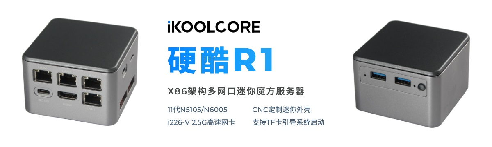

# OpenWrt とパッケージの Lean の git ソースへようこそ

I18N: [English](README_EN.md) | [简体中文](README.md) | [日本語](README_JA.md)

## 公式チャンネル

ディスカッションや共有したい技術的な質問がある場合は、以下のチャンネルにお気軽にご参加ください:

1. QQ グループ: *OpenWRT ファームウェア技術研究グループ*、グループ番号は `891659613` です。
グループに参加する: [リンク](https://jq.qq.com/?_wv=1027&k=XL8SK5aC "Op固件技术研究群")。
    - [クリックして QQ クライアントをダウンロードする](https://im.qq.com/pcqq)。

2. Telegram グループ: *OpenWRT ファームウェア技術研究グループ*。グループに参加する: [リンク](https://t.me/JhKgAA6Hx1 "OP 编译官方大群")。

## 注意

1. **OpenWRT を決して `root` としてコンパイルしないこと**
2. 中国本土にお住まいの方は、ぜひ **REAL** インターネットをご覧ください。
3. デフォルトのログイン IP は `192.168.1.1` で、パスワードは `password` です。

## コンパイル方法

1. Linuxディストリビューションをインストールし、Debian または Ubuntu LTS を推奨します。

2. 依存関係をインストールする:

   ```bash
   sudo apt update -y
   sudo apt full-upgrade -y
   sudo apt install -y ack antlr3 asciidoc autoconf automake autopoint binutils bison build-essential \
   bzip2 ccache cmake cpio curl device-tree-compiler fastjar flex gawk gettext gcc-multilib g++-multilib \
   git gperf haveged help2man intltool libc6-dev-i386 libelf-dev libglib2.0-dev libgmp3-dev libltdl-dev \
   libmpc-dev libmpfr-dev libncurses5-dev libncursesw5-dev libreadline-dev libssl-dev libtool lrzsz \
   mkisofs msmtp nano ninja-build p7zip p7zip-full patch pkgconf python2.7 python3 python3-pyelftools \
   libpython3-dev qemu-utils rsync scons squashfs-tools subversion swig texinfo uglifyjs upx-ucl unzip \
   vim wget xmlto xxd zlib1g-dev python3-setuptools
   ```

3. ソースコードをクローンし、`feeds` を更新し、設定する:

   ```bash
   git clone https://github.com/coolsnowwolf/lede
   cd lede
   ./scripts/feeds update -a
   ./scripts/feeds install -a
   make menuconfig
   ```

4. ライブラリのダウンロードとファームウェアのコンパイル
   > (`-j` はスレッドカウント、最初のビルドはシングルスレッドを推奨):

   ```bash
   make download -j8
   make V=s -j1
   ```

これらのコマンドは、ソースコードを正常にコンパイルするためのものです。
R23 のソースコードは IPK を含めてすべて含まれています。

このソースコードはご自由にお使いいただけますが、再配布の際はこの GitHub リポジトリをリンクしてください。
ご協力ありがとうございました！

リビルド:

```bash
cd lede
git pull
./scripts/feeds update -a
./scripts/feeds install -a
make defconfig
make download -j8
make V=s -j$(nproc)
```

再設定が必要な場合:

```bash
rm -rf ./tmp && rm -rf .config
make menuconfig
make V=s -j$(nproc)
```

ビルドの成果物は `bin/targets` ディレクトリに出力されます。

### WSL/WSL2 をビルド環境として使用している場合

WSL の `PATH` には、Windows のパスが空白で含まれている可能性があり、コンパイルに失敗することがあります。
コンパイルする前に、ローカルの環境プロファイルに以下の行を追加してください:

```bash
# 例えば、~/.bashrc などのプロファイルを更新した後、再読み込みを行う。
cat << EOF >> ~/.bashrc
export PATH="/usr/local/sbin:/usr/local/bin:/usr/sbin:/usr/bin:/sbin:/bin:$PATH"
EOF
source ~/.bashrc
```

WSL ディストリビューションにマウントされた NTFS フォーマットのドライブは、デフォルトで大文字と小文字が区別されません。
このため、WSL/WSL2 でコンパイルすると、次のようなエラーが発生します:

```txt
Build dependency: OpenWrt can only be built on a case-sensitive filesystem
```

単純な解決策は、`git clone` の前に大文字小文字を区別してリポジトリ用のディレクトリを作成することです:

```powershell
# 管理者としてターミナルを開く
PS > fsutil.exe file setCaseSensitiveInfo <your_local_lede_path> enable
# 大文字と小文字を区別して、このリポジトリを <your_local_lede_path> ディレクトリにクローンする
PS > git clone git@github.com:coolsnowwolf/lede.git <your_local_lede_path>
```

> すでに `git clone` されたディレクトリでは、`fsutil.exe` は有効になりません。
> 大文字小文字の区別はディレクトリの新しい変更に対してのみ有効になります。

### macOS コンパイル

1. AppStore から Xcode をインストールする

2. Homebrew をインストールする:

   ```bash
   /usr/bin/ruby -e "$(curl -fsSL https://raw.githubusercontent.com/Homebrew/install/master/install)"
   ```

3. Homebrew でツールチェーン、依存関係、パッケージをインストールする:

   ```bash
   brew unlink awk
   brew install coreutils diffutils findutils gawk gnu-getopt gnu-tar grep make ncurses pkg-config wget quilt xz
   brew install gcc@11
   ```

4. システム環境のアップデート:

   - MacのIntelシリコンバージョン

   ```bash
   echo 'export PATH="/usr/local/opt/coreutils/libexec/gnubin:$PATH"' >> ~/.bashrc
   echo 'export PATH="/usr/local/opt/findutils/libexec/gnubin:$PATH"' >> ~/.bashrc
   echo 'export PATH="/usr/local/opt/gnu-getopt/bin:$PATH"' >> ~/.bashrc
   echo 'export PATH="/usr/local/opt/gnu-tar/libexec/gnubin:$PATH"' >> ~/.bashrc
   echo 'export PATH="/usr/local/opt/grep/libexec/gnubin:$PATH"' >> ~/.bashrc
   echo 'export PATH="/usr/local/opt/gnu-sed/libexec/gnubin:$PATH"' >> ~/.bashrc
   echo 'export PATH="/usr/local/opt/make/libexec/gnubin:$PATH"' >> ~/.bashrc
   ```

   - MacのAppleシリコンバージョン

   ```zsh
   echo 'export PATH="/opt/homebrew/opt/coreutils/libexec/gnubin:$PATH"' >> ~/.bashrc
   echo 'export PATH="/opt/homebrew/opt/findutils/libexec/gnubin:$PATH"' >> ~/.bashrc
   echo 'export PATH="/opt/homebrew/opt/gnu-getopt/bin:$PATH"' >> ~/.bashrc
   echo 'export PATH="/opt/homebrew/opt/gnu-tar/libexec/gnubin:$PATH"' >> ~/.bashrc
   echo 'export PATH="/opt/homebrew/opt/grep/libexec/gnubin:$PATH"' >> ~/.bashrc
   echo 'export PATH="/opt/homebrew/opt/gnu-sed/libexec/gnubin:$PATH"' >> ~/.bashrc
   echo 'export PATH="/opt/homebrew/opt/make/libexec/gnubin:$PATH"' >> ~/.bashrc
   ```

5. シェルプロファイル `source ~/.bashrc && bash` を再読み込みすれば、Linux のように普通にコンパイルできます。

## 宣言

1. このソースコードには、HTTPS トラフィックを監視／キャプチャできるバックドアやクローズドソースアプリケーションは含まれていません。SSL セキュリティはサイバーセキュリティの最後の城です。安全性はファームウェアがすべきことです。
2. OpenWRT の開発を学びたいが、何から始めたらいいかわからないですか？自己学習のモチベーションが上がらない？基礎知識が足りない？ズオ氏の初心者 OpenWRT トレーニングコースで一緒に OpenWRT 開発を学びましょう。お申し込みは[こちら](http://forgotfun.org/2018/04/openwrt-training-2018.html)をクリックしてください。
3. QCA IPQ60xx オープンソースリポジトリ: <https://github.com/coolsnowwolf/openwrt-gl-ax1800>
4. OpenWRT アーカイブリポジトリ: <https://github.com/coolsnowwolf/openwrt>

## ソフトウェアルーター入門

Yingku R2 - N95/N300 Mini Four-Network HomeLab Server

(紹介ページ - Yingku Technology (support AliPay Huabei)):

[先行販売リンク](https://item.taobao.com/item.htm?ft=t&id=719159813003)
<div align="left">
<a href="https://item.taobao.com/item.htm?ft=t&id=719159813003">
  
</a>
</div>
<br>

## 寄付

このプロジェクトがあなたのお役に立てたのであれば、このプロジェクトの発展を支援するための寄付をご検討ください。

<div align="left">
  
</div>
<br>
