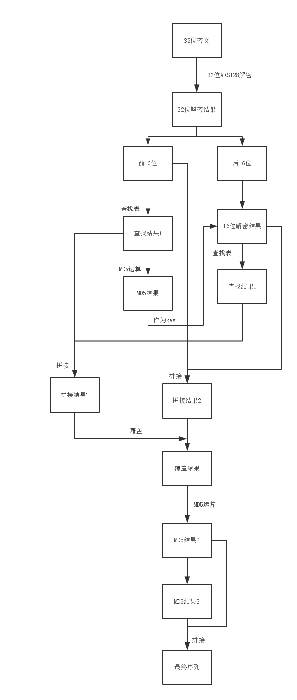

#inode 7.0 AES-MD5验证算法
inode7.0客户端上传的心跳包中有可能携带以 0x16 0x20 为开头的 32 位（不包括 0x16 0x20 ）加密序列，作为客户端合法性验证。
这一序列在接收到 EAP code 为 0x0A 的数据包之后产生。可以合理推断其生成方式与 0x0A 数据包相关。

举例说明其生成流程：
---
###第一步：
从 0x0A 数据包中获取以 0x2b 0x35 为开头的 32 位序列（不包括 0x2b 0x35 ）：
{ 0xcf, 0xfe, 0x64, 0x73, 0xd5, 0x73, 0x3b, 0x1f, 0x9e, 0x9a, 0xee, 0x1a, 0x6b, 0x76, 0x47, 0xc8, 0x9e, 0x27, 0xc8, 0x92, 0x25, 0x78, 0xc4, 0xc8, 0x27, 0x03, 0x34, 0x50, 0xb6, 0x10, 0xb8, 0x35 }

###第二步：
将该序列进行 32 位 AES128 解密。

密钥为：
{0xEC, 0xD4, 0x4F, 0x7B, 0xC6, 0xDD, 0x7D, 0xDE, 0x2B, 0x7B, 0x51, 0xAB, 0x4A, 0x6F, 0x5A, 0x22}
初始向量（IV）为：
{ 'a', '@', '4', 'd', 'e', '%', '#', '1', 'a', 's', 'd', 'f', 's', 'd', '2', '4' }

**解密结果为：**
57 cc 1a a3 87 0d 38 36 66 35 65 64 34 38 39 36 44 58 5f a4 c5 7b b2 c8 34 11 67 33 f0 a3 ab 0a

###第三步：
取解密结果的前 16 位： 57 cc 1a a3 87 0d 38 36 66 35 65 64 34 38 39 36
其中第1~4位：57 cc 1a a3 为索引序列，第五位 87 为偏移量，第六位 0d 为长度。
从查找表中查找 57 cc 1a a3 指示的序列中以 87 为初始偏移量，0d 长度的序列。

**说明：**这一操作需要的查找表来自 inode 程序本身，本质是对程序自身完整性的验证。这也意味着不同单位所需要构造的查找表可能完全不同，需要结合实际分析。

**查找结果为：**
fa 2a 8d 0c 3e 8d 44 08 01 75 32 83 c5

###第四步：
对第三步的结果进行 MD5 计算

**MD5 结果为：**
a8 7b 85 f0 8b 44 da 1d ad 0e 6f bb 04 30 ba 8f

###第五步：
取第二步解密结果的后 16 位为密文：
44 58 5f a4 c5 7b b2 c8 34 11 67 33 f0 a3 ab 0a
取第四步的 MD5 计算结果为密钥：
a8 7b 85 f0 8b 44 da 1d ad 0e 6f bb 04 30 ba 8f
重新设置初始向量 IV 为（注意：许多 AES 加密库的 IV 会在使用之后自动改变，因此需要重置后使用）：
{ 'a', '@', '4', 'd', 'e', '%', '#', '1', 'a', 's', 'd', 'f', 's', 'd', '2', '4' }
进行 16 位 AES 解密

**解密结果为：**
38 30 39 35 32 65 62 35 38 66 97 d0 23 7c 38 09

###第六步：
取第二步的解密结果前 16 位与第五步的解密结果拼接为一个新的序列：

**拼接结果为：**
57 cc 1a a3 87 0d 38 36 66 35 65 64 34 38 39 36 38 30 39 35 32 65 62 35 38 66 97 d0 23 7c 38 09

###第七步：
取第五的解密结果：38 30 39 35 32 65 62 35 38 66 97 d0 23 7c 38 09
其中第 10~14 位：97 d0 23 7c 为索引序列，第 15 位 0x38 为偏移量，第 16 位 0x09 为长度。
从查找表中查找 97 d0 23 7c 指示的序列中以 0x38 为初始偏移量，0x09 长度的序列。

**查找结果为：**
00 00 00 8b b4 24 10 12 00

###第八步：
取第三步的查找结果与第七步的查找结果拼接为新的序列，

**拼接结果为：**
fa 2a 8d 0c 3e 8d 44 08 01 75 32 83 c5 00 00 00 8b b4 24 10 12 00

###第九步：
将第八步的拼接结果“覆盖”于第六步的拼接结果之上。

**说明：**“覆盖”，意味着将新序列的值按位写入到老的序列上，如果新序列长度小于老序列，则老序列未被重写的位置仍保留原有的值；如果新序列长度大于老序列，新序列首先会被截取以免溢出。
举例：
老序列：1 2 3 4 5
新序列：7 8 9
覆盖结果：7 8 9 4 5

**覆盖结果为：**
fa 2a 8d 0c 3e 8d 44 08 01 75 32 83 c5 00 00 00 8b b4 24 10 12 00 62 35 38 66 97 d0 23 7c 38 09

###第十步：
取第九步的结果进行一次 MD5 运算，结果为：
87 19 36 28 33 10 8a 6e 16 b0 8e 33 94 36 01 54
取上一 MD5 结果再进行一次 MD5 运算，结果为：
25 11 37 2d 8d 1f b1 ab 31 aa 17 05 91 18 a6 ba
将两次MD5运算结果进行拼接，则可得最终心跳包中的序列。

**最终结果：**
87 19 36 28 33 10 8a 6e 16 b0 8e 33 94 36 01 54 25 11 37 2d 8d 1f b1 ab 31 aa 17 05 91 18 a6 ba

综上，该算法综合利用了 AES128 算法以及 MD5 算法，因此暂命名为：h3c-AES-MD5 算法。
流程图：
---

参考代码：
---
[h3c_AES_MD5.c](../src/h3c_AES_MD5.c)
